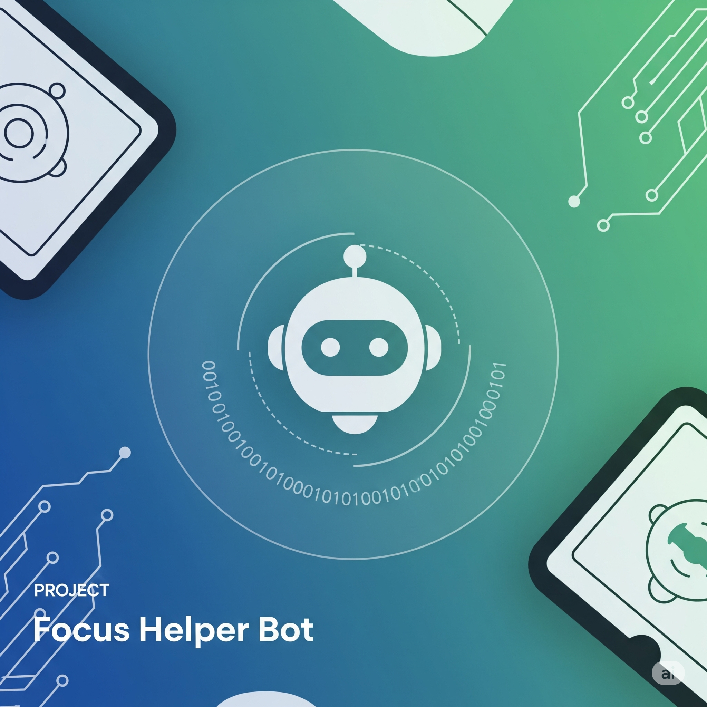

<h1 align="center">ProductivityHabitsTlgBot</h1>

A bot for managing smart habits and personal productivity.

  

---

  
<h2>Table of Contents 🧾</h2>

  
### ➤ Overview

- [Overview](#-overview)
- [Key Features & Functionalities](#-key-features--functionalities)
- [Potentialities](#-potentialities)
- [Technologies Used](#-technologies-used)
- [ProductivityHabitsTlgBot (Español)](#productivityhabitstlgbot-español)

---

<h2 align="center">🚀 Overview</h2>

**ProductivityHabitsTlgBot** is a Telegram bot designed to empower users in establishing **smart habits** and boosting their **personal productivity**. By offering intuitive task management and customizable reminders, it aims to be your digital companion in achieving your daily goals and long-term aspirations. Built with **Python**, **PostgreSQL**, and **APScheduler**, this bot provides a robust and reliable solution for personal organization.

---

<h2 align="center">✨ Key Features & Functionalities</h2>

- **User Registration & Timezone Configuration**: New users can easily onboard and set their specific timezones to ensure reminders are always punctual and locally relevant.

- **Dynamic Task Management**:
    - **Create Tasks**: Quickly add new tasks with descriptions, due dates, and customizable frequencies (one-time, daily, weekly, monthly, annually).
    - **List Tasks**: View all your pending tasks at a glance.
    - **Complete Tasks**: Mark tasks as completed, with intelligent handling for recurring vs. one-time tasks.
    - **Delete Tasks**: Remove unwanted tasks from your list.

- **Smart Reminders**: Leverages **APScheduler** to provide timely notifications for all your scheduled tasks, adapting to your configured timezone.

- **Database Persistence**: Utilizes **PostgreSQL** to ensure all your tasks and preferences are securely stored and persist across bot restarts.

- **Modular & Scalable Architecture**: Designed with a clear separation of concerns (handlers, database interactions, utilities) to facilitate future expansions and maintenance.

---

<h2 align="center">💡 Potentialities</h2>

**ProductivityHabitsTlgBot** is more than just a task manager; it's a foundation for a powerful personal assistant. Its potential can be expanded to include:

- **Habit Tracking & Analytics**: Deeper integration of habit tracking with progress visualization and analytical reports (e.g., streaks, completion rates).
- **Goal Setting**: Features to define and track larger goals broken down into smaller tasks.
- **Integration with External Services**: Connect with calendars (Google Calendar, Outlook), note-taking apps, or other productivity tools.
- **AI-Powered Suggestions**: Proactive suggestions for tasks, habits, or scheduling optimization based on user behavior.
- **Team Collaboration**: Extend functionality for small team task management and shared habits.
- **Gamification**: Introduce points, badges, or leaderboards to make productivity more engaging.

---

<h2 align="center">🛠️ Technologies Used</h2>

- **Python**: The core programming language.
- **python-telegram-bot**: Official Telegram Bot API wrapper for Python.
- **PostgreSQL**: Robust relational database for data persistence.
- **SQLAlchemy**: ORM (Object Relational Mapper) for elegant database interactions.
- **Asyncpg**: Asynchronous PostgreSQL driver for SQLAlchemy.
- **APScheduler**: Advanced Python Scheduler for managing timed tasks and recurring reminders.
- **python-dotenv**: For managing environment variables securely.
- **dateparser**: For flexible parsing of dates and times from natural language.
- **Docker & Docker Compose**: For containerization, ensuring easy deployment and environment consistency.
- **wait-for-it.sh**: A utility to orchestrate service startup in Docker Compose.

---
---

<h1 align="center">ProductivityHabitsTlgBot (Español)</h1>

Un bot para gestionar hábitos inteligentes y la productividad personal.

---

  
<h2>Tabla de Contenidos 🧾</h2>

  
### ➤ Descripción General

- [Resumen](#-resumen)
- [Características y Funcionalidades Clave](#-características-y-funcionalidades-clave)
- [Potencialidades](#-potencialidades)
- [Tecnologías Utilizadas](#-tecnologías-utilizadas)

---

<h2 align="center">🚀 Resumen</h2>

**ProductivityHabitsTlgBot** es un bot de Telegram diseñado para empoderar a los usuarios en el establecimiento de **hábitos inteligentes** y el impulso de su **productividad personal**. Al ofrecer una **gestión de tareas intuitiva** y **recordatorios personalizables**, aspira a ser tu compañero digital para alcanzar tus metas diarias y aspiraciones a largo plazo. Construido con **Python**, **PostgreSQL** y **APScheduler**, este bot proporciona una solución robusta y fiable para la organización personal.

---

<h2 align="center">✨ Características y Funcionalidades Clave</h2>

- **Registro de Usuario y Configuración de Zona Horaria**: Los nuevos usuarios pueden registrarse fácilmente y configurar sus zonas horarias específicas para asegurar que los recordatorios sean siempre puntuales y relevantes a su ubicación.

- **Gestión Dinámica de Tareas**:
    - **Crear Tareas**: Añade rápidamente nuevas tareas con descripciones, fechas de vencimiento y frecuencias personalizables (una vez, diaria, semanal, mensual, anual).
    - **Listar Tareas**: Visualiza todas tus tareas pendientes de un vistazo.
    - **Completar Tareas**: Marca las tareas como completadas, con un manejo inteligente para tareas recurrentes versus únicas.
    - **Eliminar Tareas**: Borra tareas no deseadas de tu lista.

- **Recordatorios Inteligentes**: Aprovecha **APScheduler** para proporcionar notificaciones a tiempo para todas tus tareas programadas, adaptándose a tu zona horaria configurada.

- **Persistencia de Datos**: Utiliza **PostgreSQL** para asegurar que todas tus tareas y preferencias se almacenen de forma segura y persistan a través de los reinicios del bot.

- **Arquitectura Modular y Escalable**: Diseñado con una clara separación de responsabilidades (manejadores, interacciones con la base de datos, utilidades) para facilitar futuras expansiones y el mantenimiento.

---

<h2 align="center">💡 Potencialidades</h2>

**ProductivityHabitsTlgBot** es más que un simple gestor de tareas; es la base para un potente asistente personal. Su potencial puede expandirse para incluir:

- **Seguimiento y Análisis de Hábitos**: Integración más profunda del seguimiento de hábitos con visualización del progreso e informes analíticos (ej. rachas, tasas de finalización).
- **Establecimiento de Metas**: Funcionalidades para definir y seguir metas más grandes desglosadas en tareas más pequeñas.
- **Integración con Servicios Externos**: Conexión con calendarios (Google Calendar, Outlook), aplicaciones de toma de notas u otras herramientas de productividad.
- **Sugerencias Impulsadas por IA**: Sugerencias proactivas de tareas, hábitos u optimización de horarios basadas en el comportamiento del usuario.
- **Colaboración en Equipo**: Extensión de la funcionalidad para la gestión de tareas de equipos pequeños y hábitos compartidos.
- **Gamificación**: Introducción de puntos, insignias o tablas de clasificación para hacer la productividad más atractiva.

---

<h2 align="center">🛠️ Tecnologías Utilizadas</h2>

- **Python**: El lenguaje de programación principal.
- **python-telegram-bot**: Wrapper oficial de la API de Telegram Bot para Python.
- **PostgreSQL**: Base de datos relacional robusta para la persistencia de datos.
- **SQLAlchemy**: ORM (Mapeador Objeto-Relacional) para interacciones elegantes con la base de datos.
- **Asyncpg**: Driver asíncrono de PostgreSQL para SQLAlchemy.
- **APScheduler**: Planificador avanzado de Python para gestionar tareas programadas y recordatorios recurrentes.
- **python-dotenv**: Para la gestión segura de variables de entorno.
- **dateparser**: Para el análisis flexible de fechas y horas a partir de lenguaje natural.
- **Docker y Docker Compose**: Para la contenerización, asegurando una fácil implementación y consistencia del entorno.
- **wait-for-it.sh**: Una utilidad para orquestar el inicio de servicios en Docker Compose.
